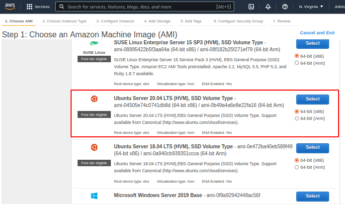

# Project 2:Web-Stack-Implementation (LEMP STACK) in AWS EC2
This project is similar to project 1 in that it is also a Web Stack, but it is different in that this will be a LEMP stack implementation as against the previous LAMP stack implementation.

What makes this stack different from the others is that it incorporates Nginx web server. The E in LEMP is for Nginx, which is pronounced as “Engine-X”.

Also, in the last project, I used the Nano editor; but in this project, I will be using VIM. Therefore, I suggest for anyone trying this project to become familiar with the Vim editor beforehand.

In this project, we will:

* Install the Nginx Server
* Install MySQL
* Install PHP
* Configure Nginx to use PHP Processor
* Test PHP with Nginx.
* Retrieve data from MySQL database with PHP

Prerequisites:

* AWS account with IAM User:


* EC2 Instance with Ubuntu Server 20.04 (HVM) SSD Volume Type:



* Connect to the launched EC2 instance from my terminal.


### Step 1 – Installing the Nginx Web Server ###

In this step, we will be installing the Niginx web server in order to display web pages to our site visitors. Nginx is a high-performance web server. We’ll use the **`apt`** package manager to install this package.

Since this is our first time using `apt` for this session, start off by updating your server’s package index. Following that, you can use `apt install` to get Nginx installed:
1. `$ sudo apt update`
2. `$ sudo apt install nginx`

When prompted, enter `Y` to confirm that you want to install Nginx. Once the installation is finished, the Nginx web server will be active and running on your Ubuntu 20.04 server.

To verify that nginx was successfully installed and is running as a service in Ubuntu, run:
3. `$ sudo systemctl status nginx`

If it is green and running, then we did everything correctly - we have just launched a Web Server in the Clouds!


Before we can receive any traffic by our Web Server, we need to open [TCP port 80](https://en.wikipedia.org/wiki/List_of_TCP_and_UDP_port_numbers) which is default port that web brousers use to access web pages in the Internet.

4. As we know, we have TCP port 22 open by default on our EC2 machine to access it via SSH, so we need to add a rule to EC2 configuration to open inbound connection through port 80:


5. $ curl http://localhost:80 or $ curl http://127.0.0.1:80

These 2 commands above actually do pretty much the same - they use ‘curl’ command to request our Nginx on port 80 (actually you can even try to not specify any port - it will work anyway). The difference is that: in the first case we try to access our server via DNS name and in the second one - by IP address (in this case IP address 127.0.0.1 corresponds to DNS name ‘localhost’ and the process of converting a DNS name to IP address is called “resolution”). We will touch DNS in further lectures and projects.


Now let's check to see if our Nginx server is responding in the web browser: http://<Public-IP-Address>:80


### STEP 2 - Installing MySQL ###

We will be using ‘apt’ again to install the MySQL software.

Now that the web server is up and running, the next step will be to install a Database Management System (DBMS) to be able to store and manage data for your site in a relational database. We will be using MySQL since it is a popular relational database management system used within PHP environments.

* Start with command: $ sudo apt install mysql-server
* When prompted, confirm installation by typing Y, and then ENTER.
* When the installation is finished, it’s recommended that you run a security script that comes pre-installed with MySQL. This script will remove some insecure default settings and lock down access to your database system. Start the interactive script by running: $ sudo mysql_secure_installation
* This will ask if you want to configure the VALIDATE PASSWORD PLUGIN. Note: You can leave validation disabled, but you should always use a strong password for database capabilities.
* Answer Y for yes, or anything else to continue without enabling.
* Validate password plugin which is used to test the strength of the password and allows the users to set said passwords. Would you like to setup validate password plugin?
* Press y|Y for Yes, any other key for No:` (If you answer “yes”, you’ll be asked to select a level of password validation. Keep in mind that if you enter 2 for the strongest level, you will receive errors when attempting to set any password which does not contain numbers, upper and lowercase letters, and special characters, or which is based on common dictionary words.)
* Press Y and hit the Enter key for the rest of the questions. *When you have finished, test if you’re able to log in to the MySQL console by typing: $ sudo mysql

*This will connect to the MySQL server as the administrative database user root, which is inferred by the use of sudo when running this command. You should see output like this:


* Run command mysql> exit

This will let you exit the mysql command prompt.

### Step 3 – Installing PHP ###

We have installed Nginx to serve our content and MySQL has been installed to store and manage our data. Now we will install [PHP](https://www.php.net/) to process code and generate dynamic content for the web server.

While Apache embeds the PHP interpreter in each request, Nginx requires an external program to handle PHP processing and act as a bridge between the PHP interpreter itself and the web server. This allows for a better overall performance in most PHP-based websites, but it requires additional configuration. You’ll need to install `php-fpm`, which stands for “PHP fastCGI process manager”, and tell Nginx to pass PHP requests to this software for processing. Additionally, you’ll need `php-mysql`, a PHP module that allows PHP to communicate with MySQL-based databases. Core PHP packages will automatically be installed as dependencies.

To install these 2 packages at once, run:

`$ sudo apt install php-fpm php-mysql`

When prompted, type `Y` and press `ENTER` to confirm installation.

You now have your PHP components installed. Next, you will configure Nginx to use them.

### Step 4 — Configuring Nginx to Use PHP Processor ###

When using the Nginx web server, we can create server blocks (similar to virtual hosts in Apache) to encapsulate configuration details and host more than one domain on a single server. In this guide, we will use **projectLEMP** as an example domain name.

On Ubuntu 20.04, Nginx has one server block enabled by default and is configured to serve documents out of a directory at `/var/www/html`. While this works well for a single site, it can become difficult to manage if you are hosting multiple sites. Instead of modifying `/var/www/html`, we’ll create a directory structure within `/var/www` for the **your_domain** website, leaving `/var/www/html` in place as the default directory to be served if a client request does not match any other sites.

Create the root web directory for **your_domain** as follows:

`$ sudo mkdir /var/www/projectLEMP`

Next, assign ownership of the directory with the $USER environment variable, which will reference your current system user:

`$ sudo chown -R $USER:$USER /var/www/projectLEMP`

Then, open a new configuration file in Nginx’s `sites-available` directory using your preferred command-line editor. Here, we’ll use `nano`:

`$ sudo vi /etc/nginx/sites-available/projectLEMP`

This will create a new blank file. Paste in the following bare-bones configuration by hitting on i on the keyboard to enter the insert mode, and paste the text:

`#/etc/nginx/sites-available/projectLEMP

server {
    listen 80;
    server_name projectLEMP www.projectLEMP;
    root /var/www/projectLEMP;

    index index.html index.htm index.php;

    location / {
        try_files $uri $uri/ =404;
    }

    location ~ \.php$ {
        include snippets/fastcgi-php.conf;
        fastcgi_pass unix:/var/run/php/php7.4-fpm.sock;
     }

    location ~ /\.ht {
        deny all;
    }

}`

* Hit the esc button

* Type :wq! and then hit enter to save the file and quite. (w = write and q =quit)

* Now, I have exited out of the vi editor and have returned to my terminal screen, which should look like this:


Here’s what each of these directives and location blocks do:

- `listen` — Defines what port Nginx will listen on. In this case, it will listen on port `80`, the default port for HTTP.
- `root` — Defines the document root where the files served by this website are stored.
- `index`— Defines in which order Nginx will prioritize index files for this website. It is a common practice to list `index.html` files with a higher precedence than `index.php` files to allow for quickly setting up a maintenance landing page in PHP applications. You can adjust these settings to better suit your application needs.
- `server_name` — Defines which domain names and/or IP addresses this server block should respond for. **Point this directive to your server’s domain name or public IP address**.
- `location /` — The first location block includes a `try_files` directive, which checks for the existence of files or directories matching a URI request. If Nginx cannot find the appropriate resource, it will return a 404 error.
- `location ~ \.php$` — This location block handles the actual PHP processing by pointing Nginx to the fastcgi-php.conf configuration file and the `php7.4-fpm.sock file`, which declares what socket is associated with `php-fpm`.
- `location ~ /\.ht`— The last location block deals with `.htaccess` files, which Nginx does not process. By adding the deny all directive, if any `.htaccess` files happen to find their way into the document root ,they will not be served to visitors.


Activate your configuration by linking to the config file from Nginx’s `sites-enabled` directory:

`$ sudo ln -s /etc/nginx/sites-available/projectLEMP /etc/nginx/sites-enabled/`

This will tell Nginx to use the configuration next time it is reloaded. You can test your configuration for syntax errors by typing:

`$ sudo nginx -t`

You shall see following message:


If any errors are reported, go back to your configuration file to review its contents before continuing.

We also need to disable default Nginx host that is currently configured to listen on port 80, for this run:

`sudo unlink /etc/nginx/sites-enabled/default`

When you are ready, reload Nginx to apply the changes:

`$ sudo systemctl reload nginx`

Your new website is now active, but the web root /var/www/projectLEMP is still empty. Create an index.html file in that location so that we can test that your new server block works as expected:

`sudo echo 'Hello LEMP from hostname' $(curl -s http://169.254.169.254/latest/meta-data/public-hostname) 'with public IP' $(curl -s http://169.254.169.254/latest/meta-data/public-ipv4) > /var/www/projectLEMP/index.html`

Now go to your browser and try to open your website URL using IP address:

`http://<Public-IP-Address>:80`


If you see the text from ***‘echo’*** command you wrote to index.html file, then it means your Nginx site is working as expected. In the output you will see your server’s public hostname (DNS name) and public IP address. You can also access your website in your browser by public DNS name, not only by IP - try it out, the result must be the same (port is optional)

`http://<Public-DNS-Name>:80`

You can leave this file in place as a temporary landing page for your application until you set up an `index.php` file to replace it. Once you do that, remember to remove or rename the `index.html` file from your document root, as it would take precedence over an `index.php` file by default.

Our LEMP stack is now fully configured. In the next step, we’ll create a PHP script to test that Nginx is in fact able to handle `.php` files within your newly configured website.

### Step 5 – Testing PHP with Nginx ###

Our LEMP stack should now be completely set up.

We will test it to validate that Nginx can correctly hand `.php` files off to the PHP processor.

We will do this by creating a test PHP file in the document root. Open a new file called `info.php` within your document root in your text editor:

`$ vi /var/www/projectLEMP/info.php`

Type or paste the following lines into the new file. This is valid PHP code that will return information about our server:

`<?php
phpinfo();`

We will now access this page in our web browser by visiting the domain name or public IP address set up in the Nginx configuration file, followed by `/info.php`:

`http://`server_domain_or_IP`/info.php`

We will see a web page containing detailed information about our server:


After checking the relevant information about the PHP server through that page, it’s best to remove the file info.php as it contains sensitive information about our PHP environment and our Ubuntu server. We will use `rm` to remove that file:

`$ sudo rm /var/www/your_domain/info.php`

This file can always be regenerated later if needed.

### Step 6 — Retrieving data from MySQL database with PHP ###

In this step we will create a test database (DB) with simple “To do list” and configure access to it, so the Nginx website would be able to query data from the DB and display it.

At the time of this writing, the native MySQL PHP library `mysqlnd` doesn’t support `caching_sha2_authentication`, the default authentication method for MySQL 8. We’ll need to create a new user with the `mysql_native_password` authentication method in order to be able to connect to the MySQL database from PHP.

We will create a database named **example_database** and a user named **example_user**, but you can replace these names with different values.

1. Connect to the MySQL console using the **root** account:
`$ sudo mysql`

2. To create a new database, run the following command from your MySQL console:

`mysql> CREATE DATABASE example_database;`

3. The following command creates a new user named example_user, using mysql_native_password as default authentication method. We’re defining this user’s password as password, but you should replace this value with a secure password of your own choosing.

`mysql> CREATE USER 'example_user'@'%' IDENTIFIED WITH mysql_native_password BY 'password';`

4. To give this user permission over the example_database database:

`mysql> GRANT ALL ON example_database.* TO 'example_user'@'%';`

This will give the **example_user** user full privileges over the **example_database** database, while preventing this user from creating or modifying other databases on your server.

5. Now exit the MySQL shell with:

`mysql> exit`

6. You can test if the new user has the proper permissions by logging in to the MySQL console again, this time using the custom user credentials:

`$ mysql -u example_user -p`

7. After logging in to the MySQL console, confirm that you have access to the example_database database:

`mysql> SHOW DATABASES;`

This will give you the following output:


8. Next, we’ll create a test table named todo_list. From the MySQL console, run the following statement:

`mysql> CREATE TABLE example_database.todo_list (item_id INT AUTO_INCREMENT,content VARCHAR(255),PRIMARY KEY(item_id));`

9. Insert a few rows of content in the test table. You might want to repeat the next command a few times, using different VALUES:

mysql> INSERT INTO example_database.todo_list (content) VALUES ("My first important item");

10. To confirm that the data was successfully saved to your table, run:

`mysql> SELECT * FROM example_database.todo_list;`


11. After confirming that you have valid data in your test table, you can exit the MySQL console:
`mysql> exit`

12. Now you can create a PHP script that will connect to MySQL and query for your content. Create a new PHP file in your custom web root directory using your preferred editor. We’ll use vi for that:
`$ vi /var/www/projectLEMP/todo_list.php`

13. The following PHP script connects to the MySQL database and queries for the content of the todo_list table, displays the results in a list. If there is a problem with the database connection, it will throw an exception.

Copy this content into your `todo_list.php` script:

```
<?php
$user = "example_user";
$password = "password";
$database = "example_database";
$table = "todo_list";

try {
  $db = new PDO("mysql:host=localhost;dbname=$database", $user, $password);
  echo "<h2>TODO</h2><ol>";
  foreach($db->query("SELECT content FROM $table") as $row) {
    echo "<li>" . $row['content'] . "</li>";
  }
  echo "</ol>";
} catch (PDOException $e) {
    print "Error!: " . $e->getMessage() . "<br/>";
    die();
}
```
Save and close the file when you are done editing.

You can now access this page in your web browser by visiting the domain name or public IP address configured for your website, followed by `/todo_list.php:`

`http://<Public_domain_or_IP>/todo_list.php`

You should see a page like this, showing the content you’ve inserted in your test table:


With this, our PHP environment is ready to connect and interact with our MySQL server.

```


                                ,.        ,.      ,.
                                ||        ||      ||  ()
 ,--. ,-. ,.,-.  ,--.,.,-. ,-.  ||-.,.  ,.|| ,-.  ||-.,. ,-. ,.,-.  ,--.
//`-'//-\\||/|| //-||||/`'//-\\ ||-'||  ||||//-\\ ||-'||//-\\||/|| ((`-'
||   || |||| ||||  ||||   || || ||  || /|||||| || ||  |||| |||| ||  ``.
\\,-.\\-//|| || \\-||||   \\-|| ||  ||//||||\\-|| ||  ||\\-//|| || ,-.))
 `--' `-' `' `'  `-,|`'    `-^-``'  `-' `'`' `-^-``'  `' `-' `' `' `--'
                  //           .--------.
              ,-.//          .: : :  :___`.
              `--'         .'!!:::::  \\_\ `.
                      : . /%O!!::::::::\\_\. \
                     [""]/%%O!!:::::::::  : . \
                     |  |%%OO!!::::::::::: : . |
                     |  |%%OO!!:::::::::::::  :|
                     |  |%%OO!!!::::::::::::: :|
            :       .'--`.%%OO!!!:::::::::::: :|
          : .:     /`.__.'\%%OO!!!::::::::::::/
         :    .   /        \%OO!!!!::::::::::/
        ,-'``'-. ;          ;%%OO!!!!!!:::::'
        |`-..-'| |   ,--.   |`%%%OO!!!!!!:'
        | .   :| |_.','`.`._|  `%%%OO!%%'
        | . :  | |--'    `--|    `%%%%'
        |`-..-'| ||   | | | |     /__\`-.
        \::::::/ ||)|/|)|)|\|           /
---------`::::'--|._ ~**~ _.|----------( -----------------------
           )(    |  `-..-'  |           \    ______
           )(    |          |,--.       ____/ /  /\\ ,-._.-'
        ,-')('-. |          |\`;/   .-()___  :  |`.!,-'`'/`-._
       (  '  `  )`-._    _.-'|;,|    `-,    \_\__\`,-'>-.,-._
        `-....-'     ````    `--'      `-._       (`- `-._`-.   hjw
```